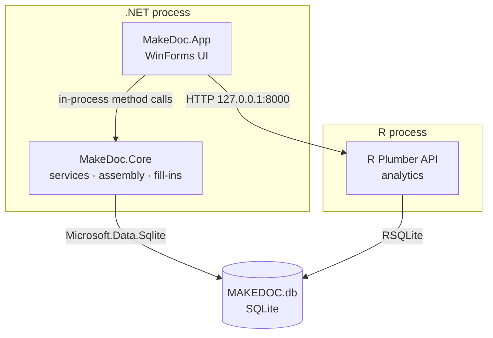

# Architecture

## Purpose

One paragraph: what MAKEDOC does end-to-end, and why the system is split into a WinForms app + Plumber API + SQLite store.

The pedagogic focus of the MAKEDOC project is to demonstrate a realization of a system that does the following:

| Feature                | Description                                   | Reference (.md) in features directory |
| :--------------------- | :-------------------------------------------- | :------------------------------------ |
| Document assembly&nbsp;| Build document from clause nodes              | assemble-document.md                  |
| Build from             | Make a copy of a document                     | build-from.md                         |
| Fill-ins               | Put data into document placeholders           | fill-in-assembly.md                   |
| Archiving              | Archiving old documents                       | document-archiving.md                 |
| Analytics              | Document analytics                            | document-analytics.md                 |
| User clauses           | Allow user to insert their own clauses&nbsp;  | user-clauses.md                        |

-   Support document assembly from clauses
-   Support build-from. Build-from lets the user make a copy of an existing document.
-   Support fill-ins in the assembled documents. Fill-ins lets the user supply data that is plugged into the document’s SDT-based placeholders.
-   Support user clauses that can be inserted into the document
-   Based on inclusion tags (as defined for each DocType), allow the user to choose a tag that will cause the system to add additional tag-related clauses to be added to the document (clause list). For example, a particular DocType may have a tag “DEI”, which, when selected, would add DEI clauses to the document – at the end of the current documet.
-   Support document archiving
-   Support document analytics
-   Support for system maintenance functions

These capabilities are all supported on the client-side, except for document analytics, which is support on the serve-side an accessed from the client using Plumber.

## Scope

What this document covers (system-level shape, component boundaries) and what it deliberately leaves to other docs (schema → `database.md`, endpoints → `r-plumber.md`, etc.).

## Key concepts

Define the vocabulary that shows up everywhere: Node, DocType, Template, HeaderNode, NodeHierarchy, Instance, Clause. Keep definitions to one or two sentences each — details belong in the component-specific docs.

## Components

Short description of each top-level piece and its responsibility.

-   **MakeDoc.App** — WinForms UI. See [forms.md](./forms.md).
-   **MakeDoc.Core** — Models + services layer. See [services.md](./services.md).
-   **MakeDoc.PlumberClient** — C\# HTTP client for the R API.
-   **plumber/** — R Plumber API that reads the SQLite DB and assembles DOCX output. See [r-plumber.md](./r-plumber.md).
-   **db/** — SQLite database, SQL, seed data, rebuild scripts. See [database.md](./database.md).

## Data flow

Walk through one end-to-end operation (e.g. "user assembles a Standard Solicitation document") so the reader can trace the request path: UI → service → HTTP → Plumber → SQLite → DOCX bytes → back up the stack.

## Dependencies

External prerequisites: .NET 9, R + required packages, SQLite, any external tools. Call out versions where they matter.

## Operational notes

How to rebuild the DB, start the Plumber server, launch the app. Point to `REBUILD_MAKEDOC_DATABASE.ps1` and any other entry-point scripts.

## Open questions

Unresolved design questions and things to revisit.
