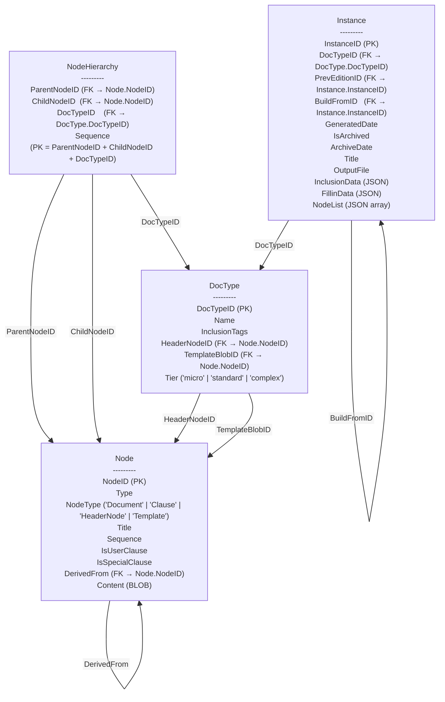

# ER Diagram for MAKEDOC

```mermaid
%%{init: {
    "flowchart": {
        "htmlLabels": false,
        "nodeSpacing": 60,
        "rankSpacing": 60
    },
    "themeVariables": {
        "fontSize": "12px"
    }
}}%%

graph TD

%% ============================
%% ENTITY DEFINITIONS
%% ============================

Node["Node
---------
NodeID (PK)
Type
NodeType ('Document' | 'Clause' | 'HeaderNode' | 'Template')
Title
Sequence
IsUserClause
IsSpecialClause
DerivedFrom (FK → Node.NodeID)
Content (BLOB)"]

DocType["DocType
---------
DocTypeID (PK)
Name
InclusionTags
HeaderNodeID (FK → Node.NodeID)
TemplateBlobID (FK → Node.NodeID)
Tier ('micro' | 'standard' | 'complex')"]

NodeHierarchy["NodeHierarchy
---------
ParentNodeID (FK → Node.NodeID)
ChildNodeID  (FK → Node.NodeID)
DocTypeID    (FK → DocType.DocTypeID)
Sequence
(PK = ParentNodeID + ChildNodeID + DocTypeID)"]

Instance["Instance
---------
InstanceID (PK)
DocTypeID (FK → DocType.DocTypeID)
PrevEditionID (FK → Instance.InstanceID)
BuildFromID   (FK → Instance.InstanceID)
GeneratedDate
IsArchived
ArchiveDate
Title
OutputFile
InclusionData (JSON)
FillinData (JSON)
NodeList (JSON array)"]

%% ============================
%% RELATIONSHIPS
%% ============================

%% Node → Node (self-reference)
Node -->|"DerivedFrom"| Node

%% DocType → Node
DocType -->|"HeaderNodeID"| Node
DocType -->|"TemplateBlobID"| Node

%% NodeHierarchy → Node + DocType
NodeHierarchy -->|"ParentNodeID"| Node
NodeHierarchy -->|"ChildNodeID"| Node
NodeHierarchy -->|"DocTypeID"| DocType

%% Instance → DocType
Instance -->|"DocTypeID"| DocType

%% Instance → Instance (self-references)
Instance -->|"PrevEditionID"| Instance
Instance -->|"BuildFromID"| Instance
```