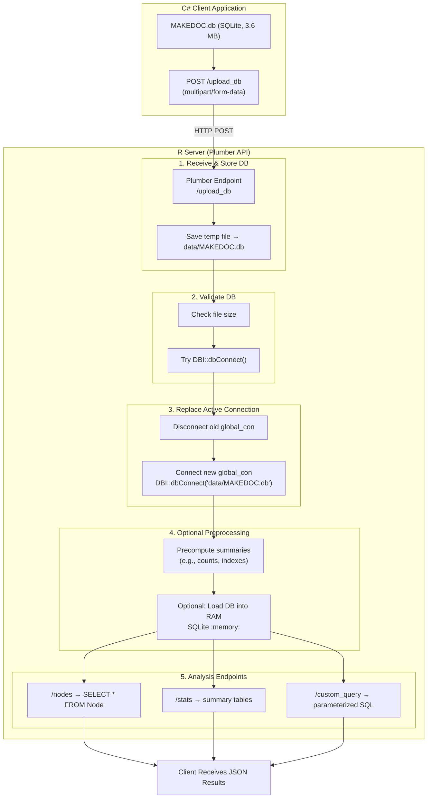

```mermaid
flowchart TD
    %% Direction
    %% LR = landscape orientation
    %% Compact grouping for clarity

    subgraph CLIENT["C# Client Application"]
        A1["MAKEDOC.db (SQLite, 3.6 MB)"]
        A2["POST /upload_db\n(multipart/form-data)"]
        A1 --> A2
    end

    A2 -->|HTTP POST| B1

    subgraph SERVER["R Server (Plumber API)"]
        direction LR

        subgraph UPLOAD["1. Receive & Store DB"]
            B1["Plumber Endpoint\n/upload_db"]
            B2["Save temp file → data/MAKEDOC.db"]
            B1 --> B2
        end

        subgraph VALIDATE["2. Validate DB"]
            C1["Check file size"]
            C2["Try DBI::dbConnect()"]
            B2 --> C1 --> C2
        end

        subgraph RELOAD["3. Replace Active Connection"]
            D1["Disconnect old global_con"]
            D2["Connect new global_con\nDBI::dbConnect('data/MAKEDOC.db')"]
            C2 --> D1 --> D2
        end

        subgraph PREP["4. Optional Preprocessing"]
            E1["Precompute summaries\n(e.g., counts, indexes)"]
            E2["Optional: Load DB into RAM\nSQLite :memory:"]
            D2 --> E1 --> E2
        end

        subgraph API["5. Analysis Endpoints"]
            F1["/nodes → SELECT * FROM Node"]
            F2["/stats → summary tables"]
            F3["/custom_query → parameterized SQL"]
            E2 --> F1
            E2 --> F2
            E2 --> F3
        end
    end

    F1 --> G1["Client Receives JSON Results"]
    F2 --> G1
    F3 --> G1
```