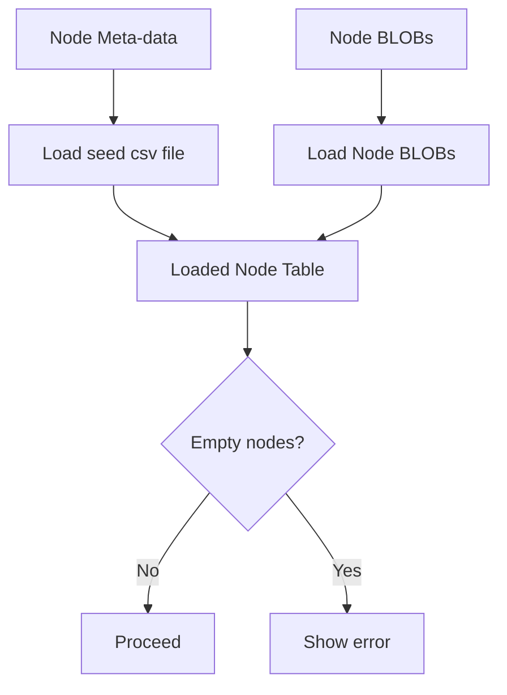

# Decisions

Architecture Decision Records for MAKEDOC. Append-only: when an old decision changes, add a new ADR and update the old one's **Status** to `Superseded by ADR-NNN` rather than editing the original.

Statuses: `Proposed` → `Accepted` → (optionally) `Superseded by ADR-NNN`.

***

## ADR-001:

-   **Date:** YYYY-MM-DD
-   **Status:** Proposed

### Context

What forced a choice. Constraints being weighed, options considered.

### Decision

What we decided. One or two sentences.

### Consequences

What gets easier. What gets harder. What's now locked in or hard to change.

***

## ADR-002:

-   **Date:** 2026-04-21
-   **Status:** Implemented

### Context

In reviewing the use of the Plumber service, the current solution has two services that are currently implemented on the server in R.

**Assembly service** – assembles final document from constituent clauses. The constituent clauses come from the Node table. Selection of the related adjacency list of node is driven by the NodeHierarchy table.

**Analytics service** – used to do document analytics on the assembled documents stored in the Instance table. Only archived document are considered for analysis.

The assembly service involved passing large amounts of BLOB data back and forth between the client (implemented in C\#) and the Plumber assembly service (implemented in R). In addition to the data passing overhead, we’re also dealing with R capabilities for managing DOCX/XML, which are not as good (complete, robust) as equivalent C\# capabilities.

### Decision

We decided to move the assembly service from the server/R side to the client/C\# side to eliminate data passing overhead and to leverage better C\# tools (like Clippit package) for managing DOCX/XML documents.

### Consequences

The consequence of this decision is better implementation of the main MAKEDOC function – to assemble documents from clauses, plus it’s faster. The assembly process already exists in the solution – take for an earlier C\# prototpye.

***

## ADR-003: In-app clause node editing

-   **Date:** 2026-04-23
-   **Status:** Proposed

### Context

Authors need to edit existing clause nodes for two reasons: to correct or improve the clause content (typos, clarity, rewording), and to author fill-ins by adding SDT fields to the clause's DOCX. Today both paths require leaving MAKEDOC, editing the clause in Word, and re-importing it via `NodeLoaderService`. That is heavy for routine content fixes and for one-field fill-in changes.

### Decision

We will support clause-node editing from inside MAKEDOC in a dedicated form (tentatively `ClauseEditorForm`), covering both content edits and add / edit / remove of SDT fields. The DOCX blob in `Node.Content` remains the source of truth — no new table or parallel store for fill-in definitions is introduced. The editing capability is deliberately placed in its own form rather than bolted onto `AdminForm`, to keep `AdminForm`'s CRUD-grid responsibility clean.

Fill-in validation is in scope for the design discussion but out of scope for implementation in the MAKEDOC book, consistent with the book's pedagogical focus.

See [features/clause-node-editing.md](./features/clause-node-editing.md) for the design — use case, service surface, UI placement, alternatives, and open questions.

### Consequences

Authors can fix typos and author fill-ins without leaving the app, which closes the loop on MAKEDOC's fill-in story and retires the Word-round-trip path for routine edits. The DOCX/OpenXml surface area in `MakeDoc.Core` grows (SDT insert / rename / remove plus a content-editing surface), building on the same stack already used by the C\# assembly path (ADR-002). Clauses remain round-trippable through Word because the canonical representation is still the DOCX blob. The open question about fill-in key identity is resolved by ADR-004. The content-editing control is deferred to the feature doc. Skipping validation now means the system accepts malformed or conflicting fill-ins at author time; when the book wants to discuss validation, it has a clean place to hang the conversation.

***

## ADR-004: Fill-in SDT form and assembly-time flow

-   **Date:** 2026-04-23
-   **Status:** Proposed

### Context

ADR-002 put document assembly on the client, in C\#, leveraging the .NET DOCX ecosystem (e.g. Clippit). As a consequence, the R/Plumber service is narrowed to document analytics, where the R ecosystem is stronger. What remained unspecified was how fill-ins are represented inside a clause, how they are discovered during assembly, and how the user supplies values.

ADR-003 decided that fill-ins are authored in-app, inside a dedicated clause editor. This ADR settles the shape of the fill-in SDT itself and the runtime flow at assembly time.

### Decision

**SDT shape.** Fill-ins are represented as **plain-text** Word SDTs. The text content of the SDT is the **name of the fill-in variable** (e.g. `effective_date`, `contractor_name`). MAKEDOC does not use the SDT's `w:tag` or `w:alias` attributes to identify fill-ins; the visible text is the identity. No typed SDTs (date, dropdown, checkbox) — plain-text only.

**Assembly-time flow.** When a document is assembled:

1.  MAKEDOC walks the `NodeHierarchy` chain for the DocType to produce the ordered list of clause `Node`s.
2.  It scans each clause's `Content` DOCX for plain-text SDTs and collects the distinct variable names — the **variable set**.
3.  If the variable set is non-empty, MAKEDOC builds (or updates) a fill-in form with one input per variable. If the assembly has a `BuildFromID` or `PrevEditionID`, the form is pre-filled from that prior instance's `FillinData`.
4.  The user supplies values. MAKEDOC re-walks the clauses and substitutes each SDT's text with the corresponding value. A variable used in N places gets the same value in all N.
5.  A new `Instance` row is written. `FillinData` is the JSON map of variable name → user value; `NodeList` is the ordered NodeIDs.

**Consequence for the R side.** With assembly on the client, R/Plumber is now for analytics only. The legacy `/assemble` endpoint documented in `r-plumber.md` is superseded and should be removed in a future pass on that doc.

See [features/fill-in-assembly.md](./features/fill-in-assembly.md) for the design — use case, service surface, UI placement, alternatives, and open questions. Authoring is covered in [features/clause-node-editing.md](./features/clause-node-editing.md).

### Consequences

The authoring surface stays small (insert / rename / remove a named plain-text SDT; no type/alias/placeholder choices). The scanner stays simple (one SDT flavor to recognize, the text is the key). Using the SDT's visible text as the variable name means the variable is readable in Word itself, which helps reviewers and supports clean round-tripping. The `Instance.FillinData` JSON gives a natural place for downstream features — re-assembly from a prior edition, auditing what values produced a given archived document, analytics on fill-in usage. We accept that malformed or colliding variable names are not caught (validation is discussed but not implemented); and that the same name appearing in multiple places is a **feature** (one value fills all occurrences) rather than an error. `r-plumber.md` now has a gap between what it documents (`/assemble`) and the decided architecture (analytics-only); it should be reworked.

***

## ADR-005: Inclusion tags as attachment DocTypes

-   **Date:** 2026-04-23
-   **Status:** Proposed

### Context

The `DocType` row has an `InclusionTags` column listing optional, context-specific clause sets the user can opt into at assembly time — for state and local procurement, this means things like DEI and HAZMAT. Two questions had to be settled together: (1) how the tag-triggered clauses are structured in the data model, and (2) how they appear in the delivered DOCX.

On (2), procurement convention treats special clauses as **attachments** to the main document rather than as content appended inline. Keeping main and special clauses visually distinct makes it obvious what is boilerplate and what is here because this particular solicitation involves DEI or HAZMAT requirements. It also aligns with the best-effort framing of MAKEDOC: the procurement specialist still owns correctness; the system delivers a clearly-structured starting point.

On (1), we considered keying inclusion clauses with a parallel adjacency structure (their own column on `NodeHierarchy`, or a separate `InclusionHierarchy` table). Those options work but duplicate the "chain walked from a header node" pattern already used for main DocTypes.

### Decision

**Inclusion tags resolve to attachment DocTypes.** Each tag names a separate `DocType` whose chain assembles into its own attachment. This collapses what would have been a parallel data model into the existing one: a tag's clause set is just another document, assembled via the same `NodeHierarchy` walk.

Specifically:

-   Add a `Type` column to `DocType` with values `main` and `attachment`. Default `main` for backward compatibility.
-   Change `DocType.InclusionTags` from a JSON string array (`["DEI", "HAZMAT"]`) to a JSON object mapping tag name to the `DocTypeID` of the attachment DocType that resolves it: `{"DEI": "<AttachmentDocTypeID>", "HAZMAT": "<AttachmentDocTypeID>"}`. Only populated on `main` rows.
-   Hide `Type=attachment` DocTypes from the assembly picker. They remain visible to admins for editing.
-   At assembly time, the user sees a checkbox per tag on the chosen main DocType. For each checked tag, the corresponding attachment DocType is assembled via the same pipeline as the main DocType. Each selected tag produces its own attachment — no grouping.
-   The output DOCX contains the main document followed by each selected attachment, separated by **section breaks**. Section breaks let attachments carry their own page numbering and optional headers/footers. Implementation uses the .NET DOCX ecosystem (Clippit's `DocumentBuilder` or Syncfusion DocIO — both handle section-property-aware merging).
-   Attachment ordering in the output follows the order of entries in the main DocType's `InclusionTags` object, giving DocType authors control without a separate ordering column.
-   `Instance.InclusionData` records both the user's tag selection and the resolved attachment DocTypeIDs used in that assembly, e.g. `{"tags": ["DEI"], "attachments": ["<DEI-DocTypeID>"]}`. This preserves the exact attachment set across future `BuildFromID` / `PrevEditionID` rebuilds.

**Book scope.** Only DEI and HAZMAT are seeded. No tag-management UI is built — tags exist because rows exist in the database. The book discusses what a production tag-management feature would look like (including whether to promote the JSON map to a normalized relationship table) without MAKEDOC actually providing one. Real procurement systems — especially Federal — need many more tags; state and local procurement (MAKEDOC's target) gets by with a handful.

**Fill-ins.** The assembly-time scanner (ADR-004) walks the full node list for the assembled output — main DocType's chain followed by each selected attachment DocType's chain. The variable set is the union across all chains; the same variable appearing in main and attachment is prompted once and substituted everywhere. No change to ADR-004's design.

**Clippit vs. Syncfusion.** ADR-002 cited Clippit as the motivation for moving assembly to C\#. Syncfusion DocIO is an equally capable alternative in the same ecosystem. This ADR treats the Clippit reference in ADR-002 as motivational (the .NET DOCX ecosystem is mature) rather than a commitment to one package; the concrete merge library is an implementation choice.

See `features/inclusion-tags.md` for the design — use case, service surface, UI placement, alternatives, and remaining open questions. (Feature doc TBD.)

### Consequences

One mechanism handles both main documents and attachments — the same `NodeHierarchy` walk, the same fill-in scanner, the same DOCX merge. The system has exactly one notion of "document," which is pedagogically cleaner and structurally simpler.

Attachment DocTypes can be reused across main DocTypes — one `DEI` attachment DocType serves every main DocType that includes the DEI tag. Attachment DocTypes naturally get their own `HeaderNodeID` and `TemplateBlobID`, which gives per-attachment headings and formatting for free without schema additions. A heading such as "Attachment A — DEI Requirements" is carried by the attachment DocType's own header node; the assembler contributes the attachment letter at merge time.

The user experience matches procurement convention (main doc + attachments in one DOCX, separated by section breaks), and the best-effort framing is visible in the output: attachments are marked as such, making it easy for the procurement specialist to confirm the system's selections.

Some consequences to accept: an attachment DocType is not itself allowed to have `InclusionTags` (one level deep, to keep the book's scope bounded). Migration from the old string-array `InclusionTags` to the new object form is a one-time seed-data rewrite. Two small follow-on choices that implementation will need to settle: whether the main document's Table of Contents (if any) lists the attachments, and whether the signature block sits at the end of the main document or at the end of the final attachment — both are noted in the feature doc.

Today (4/24/2026) I did the following:

-   Added the Type column to the DocType table.
-   Created all the new clauses for DEI and HAZMAT attachments.
-   Updated the DocType table using seed_DocType_table.sql to add two new doc types: dei and haz – for DEI and HAZMAT.
-   Updated the NodeHierarchy seed table to add the adjacency lists for the new doc types.
-   Updated the Node seed table to handle the new DEI and HAZMAT clauses/sections/headernode
-   Updated the REBUILD_MAKEDOC_DATABASE.ps1 script to remove use of the “trim trailing commas” function. This can causing problems and generating lots of warnings.
-   Updated the NodesToLoad.csv table to include the new DEI and HAZMAT content.
-   Re-ran the REBUILD_MAKEDOC_DATABASE script to rebuild the database with the new stuff. (It ran clean and produced no warnings.)
-   Checked the TraverseNodeHierarchy output to make sure the new doc types and their node hierarchies (adjacency list) are OK. They are.
-   Update DocType.cs in /Models and update MakeDocDB.cs for new Type column in the DocType table.

## ADR-006: Fix the display of nodes tab in the Admin and Assembly forms

-   **Date:** 2026-04-26
-   **Status:** Open

### Context

When you open the Admin or Assembly forms, you’re presented with a list of Doc Types. I you pick a doc type (in either form) and open the Nodes tab, you supposed to see a list of nodes associated with the doc type. This was throwing an exception and the subsequent display of nodes is empty – in both the Admin and Assembly forms.

### Decision

Because some of the Node table row’s Content fields are empty and treated as type of “text”. This throws an exception because the system expects a BLOB. These fields should be NULL instead of empty text. I added an UPDATE SQL script to convert the Content fields that are empty to NULL. This seems to fix the problem in both Admin and Assembly forms. Further research suggests that the reason some of the Content fields are NULL is that in the NodesToLoad spreadsheet, these docx files were missing. I updated the NodesToLoad spreadsheet to ensure it is correct. I re-run the REBUILD_MAKEDOC_DATABASE.ps1 script and now there are no nodes that have null content. (I’ll keep the UPDATE script step in the REBUILD script just to be sure.)

### Consequences

We need a way to make sure (a) the Node table has no rows with empty Content fields, (b) if empty fields are found then print out a list of offending
node.
An R program CheckNodes.R was developed to do just that. If empty nodes are found, the list is printed and the program exists with a return code of
1, which in turn causes the whole script to stop to allow the user time to do research.

**How the node table get populated**

***

## ADR-007: Build-from feature, same-tier compatibility, and `DocType.Tier` column

-   **Date:** 2026-05-02
-   **Revised:** 2026-05-06 — narrowed the carry-forward rule for
    `NodeList` to the same-DocType case only; cross-DocType
    same-tier build-from now rebuilds the node list from the
    target DocType's `NodeHierarchy`. See revised Decision and
    Consequences sections below; the corresponding update is in
    [features/build-from.md](./features/build-from.md).
-   **Status:** Proposed

### Context

Users frequently start a new document from a related prior one — a follow-on solicitation shaped after the requisition that drove it, an award shaped after the solicitation it followed, or simply "another one like that one." The `Instance` schema already has `BuildFromID` (for "shaped like that one") distinct from `PrevEditionID` (for revisions of the same logical document); ADR-004 wired `BuildFromID` into the assembly-time fill-in pre-fill flow. What was unspecified was the user-facing capability that *chooses* a source instance, the scope rule for which prior instances are eligible, how to carry forward all of the user's prior choices (not just fill-ins), and how to record provenance.

Two scope extremes were unattractive. Strict same-DocType is too narrow for the requisition→solicitation pattern, which crosses two DocTypes. Fully open cross-DocType makes the "carry forward" promise hollow because there's no natural alignment between unrelated document types — node lists and fill-in keys have no reason to overlap.

The natural unit is the **procurement tier** (micro, standard, complex). DocTypes within a tier share clause vocabulary and fill-in conventions; carry-forward across them is meaningful. The tier concept is in fact already present in the data — informally. DocType IDs (`req-micro`, `sol-std`, `awd-cplx`, …) and Names ("Micro tier requisition") encode it, and `Instance.InclusionData` JSON includes a `tier` field that stamps each assembly. Tier exists; it just isn't declared on `DocType`.

### Decision

We will add a build-from capability whose compatibility rule is **same tier as the source instance's DocType**. It is reachable from a new **+ New Document** button on `MainDashboard` (above the Instance table) via a "Start blank vs. Build from existing" picker step, and as a "Build from this" row action on the Instance table itself. The user picks a non-archived source, then picks a target DocType from the same tier (defaulting to the source's own DocType), then lands in `AssemblyForm` with the source's `FillinData` and `InclusionData` carried forward and reconciled against the target. The source's `NodeList` carries forward **only when the target DocType equals the source's DocType** — so a recurring school bus requisition keeps the user's added clauses and deleted boilerplate when shaped from a prior school bus requisition. When source and target DocTypes differ (still same tier — e.g., requisition → solicitation), the node list is built fresh from the target's `NodeHierarchy`, so the new document does not inherit clauses meant for a different DocType.

Archived instances appear in the source picker but are visually de-emphasized and not selectable.

To make the same-tier rule legible to the system, add a `Tier` column to `DocType`:

-   `Tier TEXT NULL` on `DocType`. Allowed values: `'micro'`, `'standard'`, `'complex'`.
-   Required by convention on `Type='main'` rows; NULL on `Type='attachment'` rows (DEI, HAZMAT) since attachments are never offered as build-from targets.
-   No `CHECK` constraint at the schema level — matches the existing style of `DocType.Type`. Document the allowed values in comments and in [database.md](./database.md).
-   Column placement: at the end of the `DocType` column list, so the seed CSV gets a new last column without disturbing existing column positions for SQLite's positional `.import`.

Seed data: backfill the new column on the existing nine main DocType rows — `req-micro`, `sol-micro`, `awd-micro` → `micro`; `req-std`, `sol-std`, `awd-std` → `standard`; `req-cplx`, `sol-cplx`, `awd-cplx` → `complex`. Leave NULL on the two attachment rows (`dei`, `haz`).

The `tier` field already present in `Instance.InclusionData` JSON becomes a per-instance denormalized stamp — useful for archive resilience (the tier value at assembly time, even if a DocType were ever re-tiered) and unchanged in shape.

See [features/build-from.md](./features/build-from.md) for the design — entry points, two-step picker, reconciliation pass, service surface, alternatives, open questions.

### Consequences

The tier concept becomes a first-class property of `DocType`, queryable directly rather than parsed from IDs/names. Build-from users can shape new documents from related prior ones in the same tier — the requisition→solicitation case works without copy/paste, and the same-tier limit prevents reconciliation from becoming meaningless.

The reconciliation pass at load time is narrower than originally scoped. Fill-in keys are intersected against the target's variable set, and inclusion tags against the target's `InclusionTags` — both bounded by the same-tier scope. The node list is *not* node-by-node reconciled against the target: in the same-DocType case the source's `NodeList` carries as-is; in the cross-DocType case the node list is built fresh from the target's `NodeHierarchy` and the source's `NodeList` is dropped wholesale. This is simpler to implement (no node-set intersection logic) and safer in practice (no risk of cross-DocType clauses bleeding in from the source), at the cost of giving up the original "carry what's compatible, append what's new" framing for the node list specifically. The cross-DocType build-from is therefore closer to a fill-in / inclusion-tag pre-fill against a fresh target structure, while the same-DocType build-from is a true full-state carry.

Fill-in key alignment across DocTypes still depends on author discipline (the SDT visible-text identity rule from ADR-004); the system doesn't enforce it. This is a known limit, not a new one — worth flagging in the book's discussion of fill-ins.

Migration is small: a `Tier` column add and a seed-data update for nine rows. The existing `InclusionData.tier` JSON stamp is unaffected.

If the tier set ever grows or picks up attributes (display order, descriptive label, allowed DocType counts), promote `Tier` from a string column to a lookup table. Until then, the string column matches the precedent set by `DocType.Type` (ADR-005).

### Work items

The schema and seed-data changes mirror the ADR-005 to-do list:

-   Add the `Tier` column to `db/sql/create_MAKEDOC_tables.sql`. ✅ Done in this commit.
-   Update `db/seed/seed_Doctype_table.csv` with `Tier` values for the nine main rows; leave NULL on the two attachment rows. ✅ Done in this commit.
-   Update `db/seed/seed_Doctype_table.xlsx` with the same `Tier` column. ⚠️ Manual step — the rebuild script regenerates the CSV from the XLSX, so the next `REBUILD_MAKEDOC_DATABASE.ps1` run will overwrite the CSV unless the XLSX has the column too.
-   Update `database.md` with the new `Tier` column and its invariants. ✅ Done in this commit.
-   Add a `Tier` property to `DocType.cs` in `MakeDoc.Core/Models/`: `public string? Tier { get; set; }`.
-   Update `MakeDocDB.cs` (and any seed-row construction code) to read/write the new column.
-   Re-run `REBUILD_MAKEDOC_DATABASE.ps1` and verify `Tier` is populated on the nine main rows.
-   (Future) Implement the build-from service surface and the picker UI per [features/build-from.md](./features/build-from.md). The service surface and UI work are not part of this ADR's commit — only the data-model groundwork.