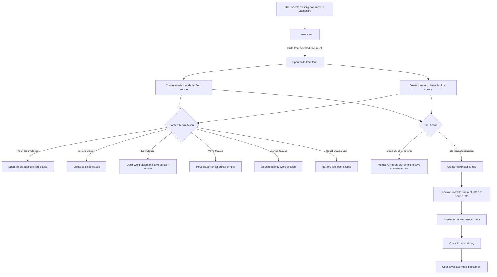

```mermaid
%%{init: {
    "flowchart": {
        "htmlLabels": false,
        "nodeSpacing": 60,
        "rankSpacing": 60
    },
    "themeVariables": {
        "fontSize": "12px"
    }
}}%%

flowchart TD

    A[User selects existing document in Dashboard] --> B[Context menu]
    B --> |Build-from selected document| C[Open Build-from form]

    C --> D[Create transient node list from source]
    C --> E[Create transient clause list from source]

    D --> F{Context Menu Action}
    E --> F

    F --> |Insert User Clause| G[Open file dialog and insert clause]
    F --> |Delete Clause| H[Delete selected clause]
    F --> |Edit Clause| I[Open Word dialog and save as user clause]
    F --> |Move Clause| J[Move clause under cursor control]
    F --> |Browse Clause| K[Open read-only Word session]
    F --> |Reset Clause List| L[Restore lists from source]

   
    D --> M{User Action}
    E --> M

    M --> |Close Build-from form| N[Prompt: Generate Document to save or changes lost]
    M --> |Generate Document| O[Create new Instance row]

    O --> P[Populate row with transient lists and source info]
    P --> Q[Assemble build-from document]
    Q --> R[Open file save dialog]
    R --> S[User saves assembled document]

```