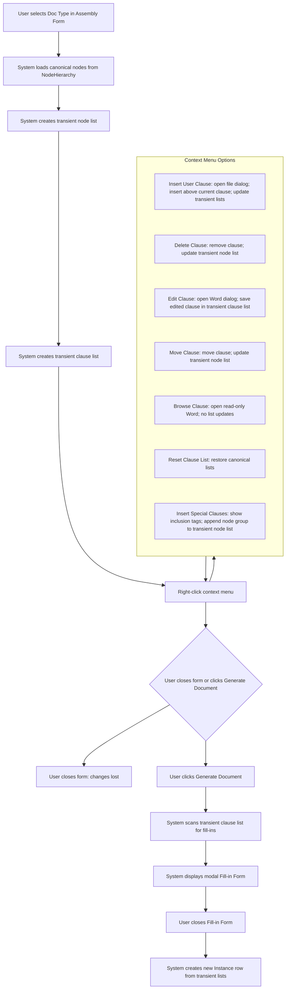

```mermaid
%%{init: {
    "flowchart": {
        "htmlLabels": false,
        "nodeSpacing": 60,
        "rankSpacing": 60
    },
    "themeVariables": {
        "fontSize": "12px"
    }
}}%%

flowchart TB

A["User selects Doc Type in Assembly Form"] --> B["System loads canonical nodes from NodeHierarchy"]
B --> C["System creates transient node list"]
C --> D["System creates transient clause list"]

%% --- Context Menu Actions Grouped in Subgraph ---
D --> E["Right-click context menu"]

subgraph MenuActions["Context Menu Options"]
    F1["Insert User Clause: open file dialog; insert above current clause; update transient lists"]
    F2["Delete Clause: remove clause; update transient node list"]
    F3["Edit Clause: open Word dialog; save edited clause in transient clause list"]
    F4["Move Clause: move clause; update transient node list"]
    F5["Browse Clause: open read-only Word; no list updates"]
    F6["Reset Clause List: restore canonical lists"]
    F7["Insert Special Clauses: show inclusion tags; append node group to transient node list"]
end

E --> MenuActions
MenuActions --> E

%% --- Exit Assembly Form ---
E --> G{"User closes form or clicks Generate Document"}

G --> H["User closes form: changes lost"]
G --> I["User clicks Generate Document"]

%% --- Generate Document Path ---
I --> J["System scans transient clause list for fill-ins"]
J --> K["System displays modal Fill-in Form"]
K --> L["User closes Fill-in Form"]

L --> M["System creates new Instance row from transient lists"]

```