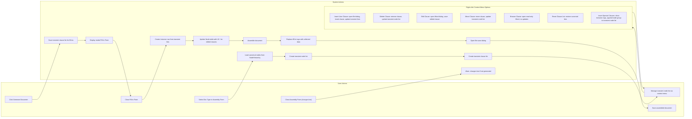

```mermaid
%%{init: {
    "flowchart": {
        "htmlLabels": false,
        "nodeSpacing": 60,
        "rankSpacing": 60
    },
    "themeVariables": {
        "fontSize": "12px"
    }
}}%%

flowchart LR

%% --- Swimlane: User ---
subgraph User["User Actions"]
    U1["Select Doc Type in Assembly Form"]
    U2["Manage transient node list via context menu"]
    U3["Close Assembly Form (changes lost)"]
    U4["Click Generate Document"]
    U5["Close Fill-in Form"]
    U6["Save assembled document"]
end

%% --- Swimlane: System ---
subgraph System["System Actions"]
    S1["Load canonical nodes from NodeHierarchy"]
    S2["Create transient node list"]
    S3["Create transient clause list"]

    %% Context Menu Subgraph
    subgraph MenuActions["Right-click Context Menu Options"]
        M1["Insert User Clause: open file dialog, insert clause, update transient lists"]
        M2["Delete Clause: remove clause, update transient node list"]
        M3["Edit Clause: open Word dialog, save edited clause"]
        M4["Move Clause: move clause, update transient node list"]
        M5["Browse Clause: open read-only Word, no updates"]
        M6["Reset Clause List: restore canonical lists"]
        M7["Insert Special Clauses: show inclusion tags, append node group to transient node list"]
    end

    S4["Warn: changes lost if not generated"]
    S5["Scan transient clause list for fill-ins"]
    S6["Display modal Fill-in Form"]
    S7["Create Instance row from transient lists"]
    S8["Update Node table with UC-<guid> for edited clauses"]
    S9["Assemble document"]
    S10["Replace fill-in tags with collected data"]
    S11["Open file-save dialog"]
end

%% --- Flow Connections ---
U1 --> S1 --> S2 --> S3 --> U2
U2 --> MenuActions --> U2
U3 --> S4
U4 --> S5 --> S6 --> U5 --> S7 --> S8 --> S9 --> S10 --> S11 --> U6


```