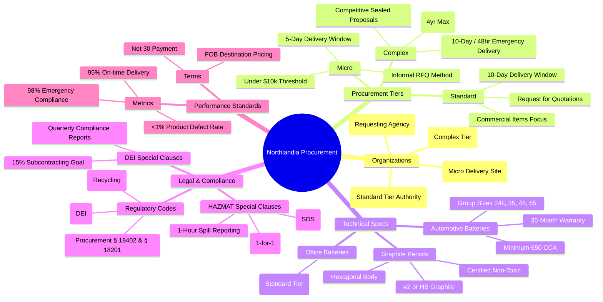

```mermaid
mindmap
  root((Northlandia Procurement))
    Organizations
      DAS (Requesting Agency)
      Central Procurement Office (Complex Tier)
      NPPA (Standard Tier Authority)
      Fleet Services (Micro Delivery Site)
    Procurement Tiers
      Micro
        Under $10k Threshold
        Informal RFQ Method
        5-Day Delivery Window
      Standard
        Commercial Items Focus
        Request for Quotations
        10-Day Delivery Window
      Complex
        Statewide Scope (4yr Max)
        Competitive Sealed Proposals
        10-Day / 48hr Emergency Delivery
    Technical Specs
      Automotive Batteries
        Group Sizes 24F, 35, 48, 65
        Minimum 650 CCA
        36-Month Warranty
      Graphite Pencils
        #2 or HB Graphite
        Hexagonal Body
        Certified Non-Toxic
      Office Batteries
        AA Alkaline (Standard Tier)
    Legal & Compliance
      Regulatory Codes
        Procurement § 18402 & § 18201
        Environmental § 22301 (Recycling)
        Accessibility A-12 (DEI)
      DEI Special Clauses
        15% Subcontracting Goal
        Quarterly Compliance Reports
      HAZMAT Special Clauses
        Safety Data Sheets (SDS)
        1-Hour Spill Reporting
        Recycling Program (1-for-1)
    Performance Standards
      Metrics
        95% On-time Delivery
        <1% Product Defect Rate
        98% Emergency Compliance
      Terms
        Net 30 Payment
        FOB Destination Pricing
```