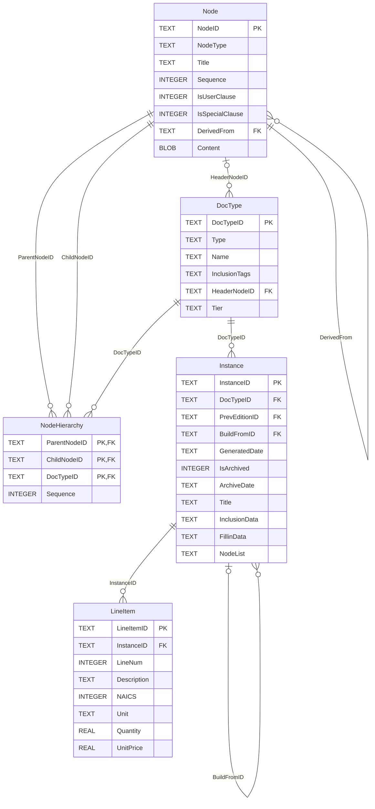

# MAKEDOC Schema

```mermaid
erDiagram
    Node {
        TEXT NodeID PK
        TEXT NodeType
        TEXT Title
        INTEGER Sequence
        INTEGER IsUserClause
        INTEGER IsSpecialClause
        TEXT DerivedFrom FK
        BLOB Content
    }
    NodeHierarchy {
        TEXT ParentNodeID PK,FK
        TEXT ChildNodeID PK,FK
        TEXT DocTypeID PK,FK
        INTEGER Sequence
    }
    DocType {
        TEXT DocTypeID PK
        TEXT Type
        TEXT Name
        TEXT InclusionTags
        TEXT HeaderNodeID FK
        TEXT Tier
    }
    Instance {
        TEXT InstanceID PK
        TEXT DocTypeID FK
        TEXT PrevEditionID FK
        TEXT BuildFromID FK
        TEXT GeneratedDate
        INTEGER IsArchived
        TEXT ArchiveDate
        TEXT Title
        TEXT InclusionData
        TEXT FillinData
        TEXT NodeList
    }
    LineItem {
        TEXT LineItemID PK
        TEXT InstanceID FK
        INTEGER LineNum
        TEXT Description
        INTEGER NAICS
        TEXT Unit
        REAL Quantity
        REAL UnitPrice
    }

    Node ||--o{ Node : "DerivedFrom"
    Node ||--o{ NodeHierarchy : "ParentNodeID"
    Node ||--o{ NodeHierarchy : "ChildNodeID"
    DocType ||--o{ NodeHierarchy : "DocTypeID"
    Node |o--o{ DocType : "HeaderNodeID"
    DocType ||--o{ Instance : "DocTypeID"
    Instance |o--o{ Instance : "PrevEditionID"
    Instance |o--o{ Instance : "BuildFromID"
    Instance ||--o{ LineItem : "InstanceID"
```
