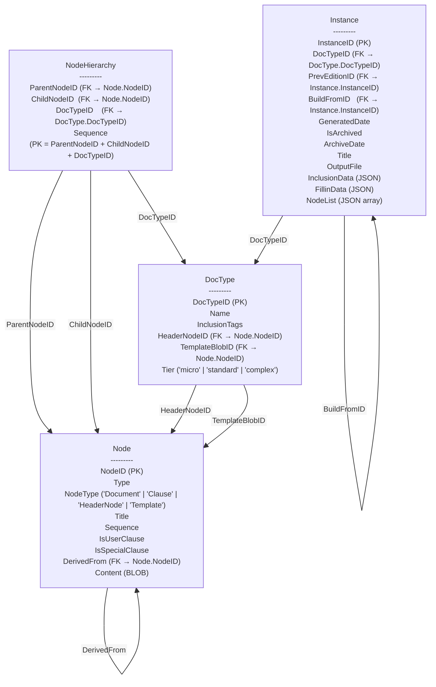
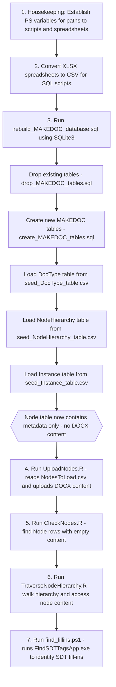

# Maintaining MAKEDOC
The MAKEDOC system is a vehicle used by the book to explain and illustrate the key features of most document building systems. The aim is pedagogical. Although MAKEDOC can indeed produce acceptable looking procurement documents, it was not designed for production use. 

One of the topics that is discussed in detail is maintenance of the MAKEDOC database. The maintenance part, although discussed, it not built-out in the code found in the MAKEDOC repo. If the maintenance part had been built-out, it would eclipse size and complexity of the document building part and would, in the book, divert attention away from the main document building topics.

This approach begs the question: "Where did the MAKEDOC.db (in the repo) come from?" The answer to this question is that the MAKEDOC.db is the result of a **seeding** process that puts the pieces of the MAKEDOC.db puzzle together -- from scratch. This "seeding" process is done using these tools:
- SQL scripts to define the tables.
- Excel documents to load the tables.
- R scripts to manage loading the text documents that make up the clause library of MAKEDOC
- PowerShell scripts to manipulate Excel seed documents, etc.

This document breaks down the seeding process, discussing each step.

## Tables in the MAKEDOC Database
There are 4 tables in the MAKEDOC system:
- DocType table - defines different document types based on the dollar amount (the **tier**) and the procurement phase (the **phase**) which includes: requisition phase, solicitation phase and award phase. As such, there are 9 different document types:
    - Micro requisition: small dollar requisition
    - Micro solicitation: small dollar solicitation
    - Micro award: small dollar award
    - Standard requisition: medium dollar requisition
    - Standard solicitation: medium dollar solicitation
    - Standard award: medium dollar award
    - Complex requisition: high dollar requisition
    - Complex solicitation: high dollar solicitation
    - Complex award: high dollar award
- NodeHierarchy table that defines clause ordering in the 9 different document types
- Node table that contains the text of the clauses
- Instance table that define assembled documents

Here's an ER diagram for the MAKEDOC database:

## Overall script
All of the steps of the seeding process are driving by the REBUILD_MAKEDOC_DATABASE.ps1 PowerShell script. Here's how that script breaks down:

1. Housekeeping. Establish PS variables to establish paths to:
- Path to script resources, e.g. PowerShell scripts 
- Path to SQL scripts, and 
- Path to Excel spreadsheets

2. Since the Excel spreadsheets are maintained in .xlsx format, these .xlsx file are converted to .csv format by use in the SQL scripts.

3. The SQLite3 application is used to run the **rebuild_MAKEDOC_database.sql** script. This SQL script does the following:
- Drop all of any existing tables: **drop_MAKEDOC_tables.sql** script
- Create new MAKEDOC tables: **create_MAKEDOC_tables** script
- Load the DocType table from the **seed_DocType_table.csv** file: **load_DocType_table.sql** script
- Load the NodeHierarchy table from the **seed_NodeHierarchy_table.csv** file: **load_NodeHierarchy_table.sql** script
- Load the Instance table with 3 pre-configured assembled documents from the **seed_Instance_table.csv** file: **load_Instance_table.sql** script

**Note at this point the Node table has metadata, doesn't have any DOCX content.

4. Run the UploadNodes.R script to upload the Node content. This program reads the **NodesToLoad.csv** file.

5. Run the **CheckNodes.R** program that goes against the Node table looking for Nodes that have empty content.

6. Run the **TraverseNodeHierarchy.R** script to check the NodeHierarchy table and to access each node's content.

7. Run the **find_fillins.ps1** PowerShell script. This script runs the **FindSDTTagsApp.exe** C# program to look at each Clause node and identify its SDT fill-ins.

