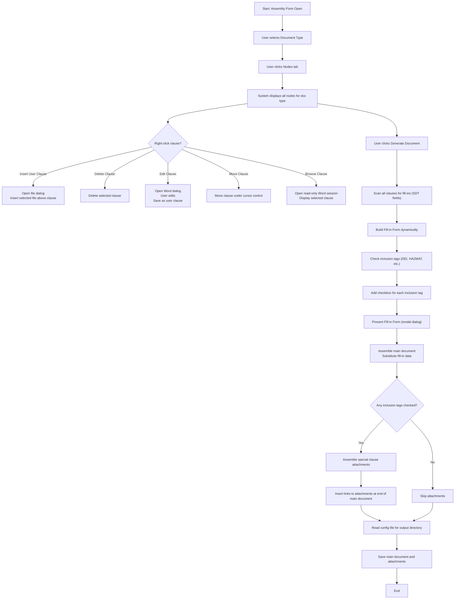

# Notes on Generate Document button:

This note expands on actions in the Assembly form that occur at the time the Generate Document
button is clicked -- and after. 

## Special Circumstances
- Special clauses (e.g. DEI, HAZMAT, etc) have no fill-ins.
- When a user clause is added, it saved in the node table and the NodeList field in the associated Instance object is updated. If this document/instance is used to do a build-from,
the user clause node ID is copied forward into the new target's NodeList field. The NodeHierarchy table is not updated for the doc type in question. That is, the user clause
only lived in the instance in which it was added. If the user can to include the user clause in a future document, he/she must re-add it.
- Boilerplate clauses (e.g. NL-<nnnn>) may not be deleted. 

## User clause semantics
- User clause node ID has this syntax: **UC-\<short GUID\>**
- When a user clause node is added, the *IsUserClause* flag field is set to 1 (default is 0) in the Node table.
- A user clause belongs only to the document/instance to which it was added.

## Here's is a possible scenario:

## Assembly Form 

- **In the Assembly Form**, the user selects a document type, then clicks on the **Nodes** tab.
  - The system displays all nodes for that document type. 
  - The user may right‑click a clause and choose one of the following from the context menu:

    - **Insert User Clause** — System opens a file‑open dialog; the selected file is inserted above the current clause.
    - **Delete Clause** — System deletes the selected clause.
    - **Edit Clause** — System opens a Word session in a dialog; user edits the clause; system saves it as a user clause.
    - **Move Clause** — System moves the clause under cursor control.
    - **Browse Clause** — System opens a read‑only Word session displaying the selected clause.

- The user clicks the **Generate Document** button.
-- The list of clauses (including user clauses) that make up the document are scanned for presence of fill-ins (SDT fields).
-- The Fillin form is dynamically built from the fill-in list. 
- Check the doc type inclusion tags, e.g. DEI, HAZMAT, etc.
- For each inclusion tag, a checkbox is added to the fill-in form.
- Present the fill-in form as modal dialog.
- Assemble the main document: the fill-in data is substituted for the fillin SDT tags in the assembled document.
- If any inclusion tags have been checked:
-- Assemble special clause attachements
-- Insert links to the attachment document(s) at the end of the main document.
- The config file is accessed to determine the directory designated to hold assembled documents (main documents and attachments)
- Save the main document and any attached in the desinated directory.

- The name of the assembled document in the assembled directory is generated so that it identifies the document. That is, the name contains:
-- Document type
-- Date/Time Generated
-- Short GUID to guarantee uniqueness.
-- .DOCX extension
- The name of the attachment document(s) is generated. The name includes:
-- The prefix "ATTACHMENT"
-- Document type
-- Date/Time Generated
-- Short GUID to guarantee uniqueness.
-- .DOCX extension

## Other Considerations
Here is additional design guidance:

### At Analysis Time
When the user can to do analysis, the following happens:
- The entire contents of the assembledDocumentsDirectory (as specified in the /config file) are zipped up.
- The zip file is sent as a parameter in a Plumber post.
- On the R-server side, this zip file is unzipped so permit analysis. (The particulars here are yet to be determined.)

### Using AI to analyze a collection of assembled documents
- I'd like to demonstrate how AI can be used with the procurement docs -- using anything llm:
-- Setup (both manually and programmatically) a workspace.
-- Add the procurement docs in the assembledDocumentsDirectory (see /config file) as sources for the workspace.
-- Develop some meaningful queries against the workspace.

