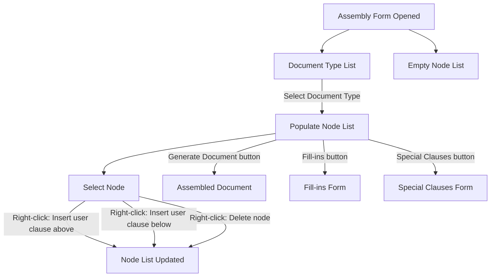

# Assembly Feature

## Purpose
The primary purpose of the assembly feature is to build documents of a selected document type. Secondary purposes include inserting
a user clause, deleting a clause (either boilerplate or user), supplying fill-in data for the document, selecting any special clauses 
(assembled separately as an attachment)

## Access
The assembly feature is accessed from the MAKEDOC main menu. Once the assembly dialog is opened:

- Displays a list of document types on the left
- Displays an empty list of nodes

When the document type is selected from the list, the node list is populated with all of the nodes (sections, clauses) that will 
go into the assembled document (in order of inclusion)

Once the node list is populated and a node is selected, right-clicking on the selected node will present the user with these options:
- **Insert user clause above** the current selection
- **Insert user clause below** the current selection
- **Delete the currently selected node**

In terms of buttons in the assembly form:
- **Generate Document button** drives the assembly of a document based on the current state of the node list.
- **Fill-ins button** opens a new form that is dynamically generated based on the fill-ins found in the current node list.
- **Special Clauses button** opens a new form that allows the user to select any special clauses (assembed in a separated document as an attachment)
that are configured for the current document type selected. 

