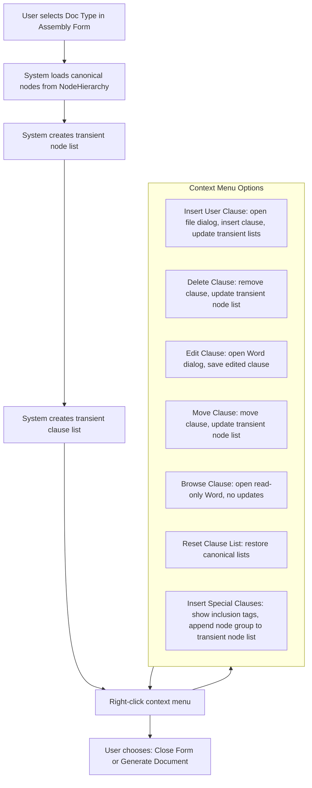

```mermaid
flowchart TB

A["User selects Doc Type in Assembly Form"] --> B["System loads canonical nodes from NodeHierarchy"]
B --> C["System creates transient node list"]
C --> D["System creates transient clause list"]

%% --- Context Menu Actions Grouped ---
D --> E["Right-click context menu"]

subgraph MenuActions["Context Menu Options"]
    M1["Insert User Clause: open file dialog, insert clause, update transient lists"]
    M2["Delete Clause: remove clause, update transient node list"]
    M3["Edit Clause: open Word dialog, save edited clause"]
    M4["Move Clause: move clause, update transient node list"]
    M5["Browse Clause: open read-only Word, no updates"]
    M6["Reset Clause List: restore canonical lists"]
    M7["Insert Special Clauses: show inclusion tags, append node group to transient node list"]
end

E --> MenuActions --> E

%% --- Exit Decision ---
E --> X["User chooses: Close Form or Generate Document"]

```