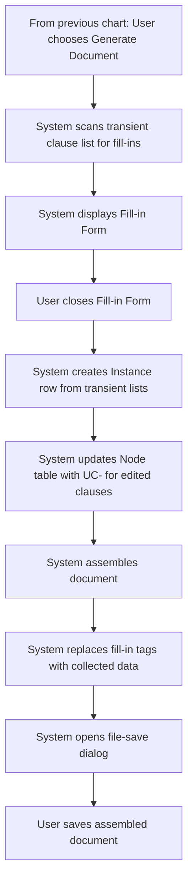

```mermaid
flowchart TB

X["From previous chart: User chooses Generate Document"] --> G1["System scans transient clause list for fill-ins"]
G1 --> G2["System displays Fill-in Form"]
G2 --> G3["User closes Fill-in Form"]
G3 --> G4["System creates Instance row from transient lists"]
G4 --> G5["System updates Node table with UC-<guid> for edited clauses"]
G5 --> G6["System assembles document"]
G6 --> G7["System replaces fill-in tags with collected data"]
G7 --> G8["System opens file-save dialog"]
G8 --> G9["User saves assembled document"]
```