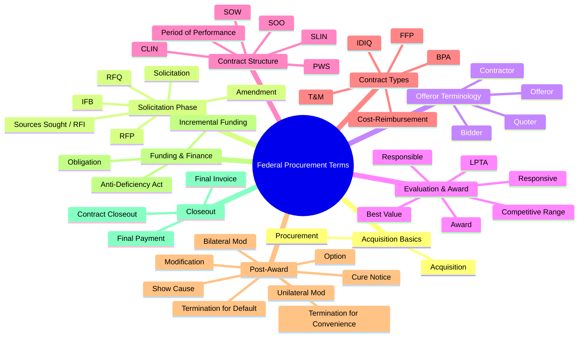
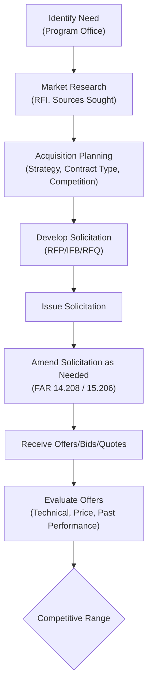
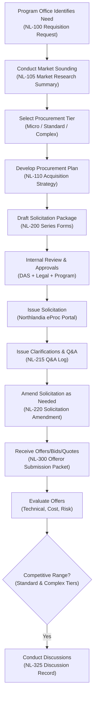

# Procurement Glossary Mindmap

```mermaid
mindmap
  root((Federal Procurement Terms))

    Acquisition Basics
      Acquisition
      Procurement

    Solicitation Phase
      Solicitation
      RFP
      IFB
      RFQ
      Sources Sought / RFI
      Amendment

    Offeror Terminology
      Offeror
      Bidder
      Quoter
      Contractor

    Evaluation & Award
      Responsive
      Responsible
      Best Value
      LPTA
      Competitive Range
      Award

    Contract Structure
      CLIN
      SLIN
      SOW
      PWS
      SOO
      Period of Performance

    Contract Types
      FFP
      T&M
      Cost-Reimbursement
      IDIQ
      BPA

    Post-Award
      Modification
      Unilateral Mod
      Bilateral Mod
      Option
      Cure Notice
      Show Cause
      Termination for Convenience
      Termination for Default

    Funding & Finance
      Obligation
      Incremental Funding
      Anti-Deficiency Act

    Closeout
      Final Invoice
      Final Payment
      Contract Closeout


```

# Procurement lifecycle

```mermaid
flowchart TB

    %% --- Need Identification ---
    A["Identify Need<br/>(Program Office)"] --> B["Market Research<br/>(RFI, Sources Sought)"]

    %% --- Planning ---
    B --> C["Acquisition Planning<br/>(Strategy, Contract Type, Competition)"]
    C --> D["Develop Solicitation<br/>(RFP/IFB/RFQ)"]

    %% --- Solicitation ---
    D --> E["Issue Solicitation"]
    E --> F["Amend Solicitation as Needed\n(FAR 14.208 / 15.206)"]

    %% --- Offer Phase ---
    F --> G["Receive Offers/Bids/Quotes"]
    G --> H["Evaluate Offers<br/>(Technical, Price, Past Performance)"]
    H --> I{"Competitive Range"}
```

# Northlandia Procurement Lifecycle

```mermaid
flowchart TB

    %% --- Need Identification ---
    A["Program Office Identifies Need<br/>(NL‑100 Requisition Request)"] 
        --> B["Conduct Market Sounding<br/>(NL‑105 Market Research Summary)"]

    %% --- Planning ---
    B --> C["Select Procurement Tier<br/>(Micro / Standard / Complex)"]
    C --> D["Develop Procurement Plan<br/>(NL‑110 Acquisition Strategy)"]

    %% --- Solicitation Development ---
    D --> E["Draft Solicitation Package<br/>(NL‑200 Series Forms)"]
    E --> F["Internal Review & Approvals<br/>(DAS + Legal + Program)"]

    %% --- Release ---
    F --> G["Issue Solicitation<br/>(Northlandia eProc Portal)"]
    G --> H["Issue Clarifications & Q&A<br/>(NL‑215 Q&A Log)"]
    H --> I["Amend Solicitation as Needed<br/>(NL‑220 Solicitation Amendment)"]

    %% --- Offer Phase ---
    I --> J["Receive Offers/Bids/Quotes<br/>(NL‑300 Offeror Submission Packet)"]
    J --> K["Evaluate Offers<br/>(Technical, Cost, Risk)"]
    K --> L{"Competitive Range?<br/>(Standard & Complex Tiers)"}

    L -->|Yes| M["Conduct Discussions<br/>(NL‑325 Discussion Record)"]
    M["Conduct Discussions<br/>(NL‑325 Discussion Record)"]

```